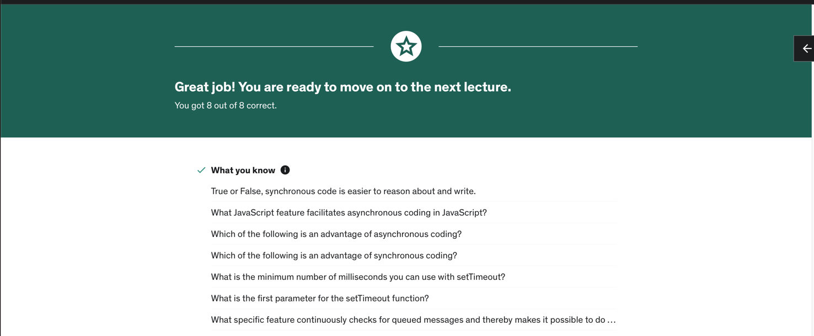

Cmd + Opt + K => Chrome javascript console
star wars api new domain
https://swapi.dev
# ASYNC JAVASCRIPT NOTES
## Synchronous vs Asynchronous
Synchronous javascript is "normal" javascript each block of code the program execution waits for the immediate block before to end to actually continuee
This code is called blocking code, because you can be waiting for the other things to happen
Non blocking is preferable because you dont block other things from happening

You know that the program may take several amount on time so you say the program to keep going and while its running

## THE EVENT LOOP
Manages code queues 
As things are added to its queues it keeps going around or looping making sure that every single thing is handled
By putting items into the queue thats a part of the event loop instead of taking care of them right away it allows the 
javascript engine to do other things 
Instead of waiting for something to finish we are doing other things at the same time and the event loop comes back 
and visit those things that have been queued that need to be taken care of
*it basically makes asyncrhonicity possible in javascript*

## CALLBACK PATTERN
The traditional way of achieving Asynchronous code in javascript
### What is a callback
Is a function that is invoked or called after something else happens
Whether or not the function runs depend entirely on something else happening
**A Callback itselft does not make the code asynchronous as it doesnt take advantage of the event loop** 

### How to achieve callbacks
Passing a function into another function and then the function that ewe passed in is calledback excecuted after
something else has occurred 
This is possible because of JS higher order functions 
### Common Applications
- Event listeners .addEventListener() method
### Make sure
- We are not causing some of the code to be async and not all of the code that it relies on
- We are not causing things to be executed out of order
### Callbacks Problems
- Callback hell (bunch of nested callbacks) 
- Difficult to reason abt 
- Inversion of control (turning control mover your code over to something else that is something that occurs in callbacks)

## PROMISES
### What promises are
- An Object with properties and methods
- Represents The eventual Completion or failure of an async operation
- Provides a Resulting value

If a function returns a Promise we can then use that promise to wait for the code to finish and then see the results
that makes promises Asynchronous 

### .then method
The function that is invoked once the promise is resolved
you can pass two functions, for both resolved and error cases

`.then(resolvedFunction, errorFunction)`

### The callback hell problem
When we talked about callbacks we get to a big code quality problem which we called callback hell
With promises you can improve your code quality by improving the code readability and maintainability by chaining promises

### Chaining promises
`fetch(url + num + "/")
    .then((data) => {
        return data.json();
    })
    .then((obj) => {
        console.log(obj)
})`
If the function we passed at the .then method return a promise 
You can chain promises by using the .then method right after the .then method
You will end looking at something that more or less looks like this

.then(functionReturningAPromise()).then(someOtherFunction)

This is an expected behaviour when working with promises and there are lots of real world cases where we can find this

### Fetching And Promises
fetch method actually returns a Promise. 
It is used to fetch data from any api in a simple and easy way (without too much configuration)

`fetch(url + num + "/")
    .then((data) => {
        return data.json();
    })
    .then((obj) => {
        console.log(obj)
})`

the First data object returns the response object
The .json method returns a Promise which allows us to chain some other promises when necessary
We are chaining that promise we returned at the first arrow function with another arrow function that logs the response

We can also (for example) chain this case with another fetching that uses the first response, in that case you will have to
make your first function return the new fetch. 

### Error Handling
As we saw before we can specify two functions within the then method. The first would be the success or resolved case and the error case
Sometimes this can make it difficult, specially working with chained promises

If it is the case you can use the .catch method which catches any error and whenever we are on an error case it will use the function
passed to that method

.catch(errorCaseFunction)

### Creating Promises
We create promises with the promise constructor
It receives a callback function with two parameters which are resolve and reject functions
`let a = new Promise(callbackFunction(resolveFunction, rejectFunction))`
And you can set the .then method behaviour

`a.then(function(val) {
    logsuccess}), function (error) {
    logError}
})`

You can create function with promises by returning an anonymous promise or returning a created promise at the function

Using this approach is the turning callbacks into promises pattern

### The finally method
`promise.then().finally(Callbackfunction)`

Whatever happens with the promise either if it is rejected or success it doesnt matter this code is gonna run
Something that you need to have executed everytime.

### Promise Static methods
- Promise.all(Promise[]) => returns a promise that will be fullfilled if and only if every promise in the array is fullfilled
- Promise.race(Promise[]) => returns the first resolved promise
- Promise.allSettled(Promise[]) => It returns an array with every response, it waits till every promise has finished 
- Promise.any(Promise[]) => Waits till any promise is fullfilled 

### Abort
Is something taking longer than expected?
`controller function: new AbortController();
signal: controller.signal
controller.abort();
`

## Async Await
Enables us to write promise based code as if it was syncrhonous code
Code will look like Synchrnous Code but with asynch functionality 

Basically it extends promises making them more powerful

### Async Keyword
It is used with a function, when you use async with a function declaration
it forces the function to return a promise

If the function is already returning a value that value is wrapped in a promise 

### Await keyword
It can only be used along with the async keyword 
Into the async function

It waits for a promise 
It causes the Async function to pause.

If i have a promise into an async function and i use the await keyword, the program will be
waiting for that promise

### Try catch and error handling
It is as easy as wrapping the async function body at the "try" block
and then using the "catch" block for any error handling

If it is necessary you can throw an exception in order to handle thoise errors via arriving to the "catch"

### Important things about async await
- It doest make your code asynchronous, nor async functions nor the await keyword make your code asynchronous itself
- You can use any of the Promises static methods .all ... inside your async functions 
- It is easier to reason about
- it is not necessarily performant
- Keep it simple! When writing async functions (and in general) do smaller tasks

## Generators 
Generators are functions that we can use to cause the code to yield and the code wont continue 
I is a functions that you can exit and then re-enter at the point you exited, it is even possible
to never re-enter the function 

you cant use arrow functions as generators you will need a regular function

### the * 
In order to turn a function into a generator or a generator function you have use the *
`function * functionName(){}`

### the yield keyword
The yield keyword "marks" where you want to exit the code.
- Place the yield keyword right where you want to exit the code
- You can pass a value to the yield and access it at the code like a "pseudo-return" or "stepped return"
- You can think about yields like every step you need at any method

### the .next method
It runs until it finds a yield 

### Two-way communication
One of the most important features of Generators is that it allows two-way communication

for passing a value in:
you can yield a variable= 

`let variableT = yield`
 then at the .next method you can pass that value
`.next("any value here")`

With yield you can both accept a value, so you're passing value into the function, and you can pass a value
out of the function 
